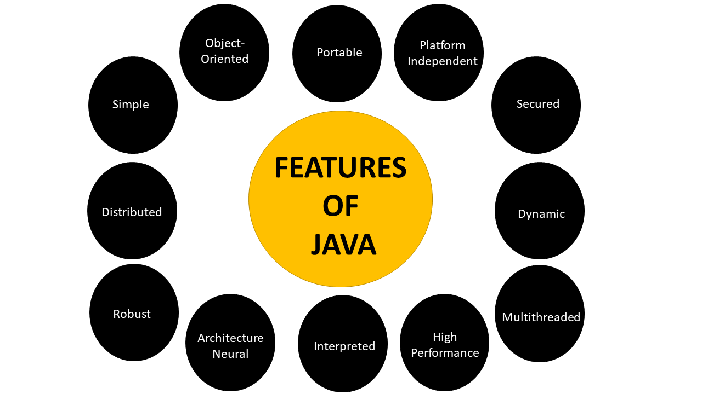

# Learn-Java-From-Scratch
This is the perfect repository to start with java.

 

## What is Java?

Java is a multi-platform, object-oriented, and network-centric language. It is among the most used programming language. Java is also used as a computing platform.

It is considered as one of the fast, secure, and reliable programming languages preferred by most organizations to build their projects.

## About Java Platform

Java Platform is a collection of programs that help programmers to develop and run Java programming applications efficiently. It includes an execution engine, a compiler, and a set of libraries in it. It is a set of computer software and specifications.

## Uses of Java

- Used for developing Android Apps.
- Used to develop Web Apps.
- Used to develop Desktop Apps.
- Used for Database connection.
- Used in Web servers and application servers
- Used in developing Games.
- Scientific Computing Applications.

## Features of Java

